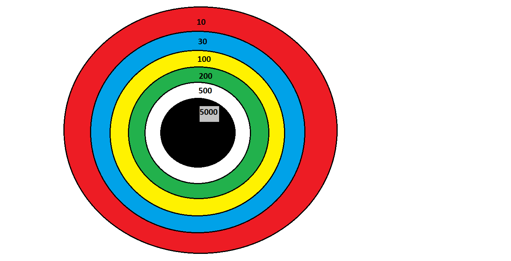

# Dart-Board-Game
This repository lets you Python code for Dart-Board game. It is a collection of Python Codes which will register a user and throw a dart and score points.

In this game we need to throw dart over board and try to score luck :-

    (None = 0),
    ("Red" = 10),
    ("Blue" = 30),
    ("Yello" = 100),
    ("Green" = 200),
    ("White" = 500),
    ("Black" = 5000)

# Image for Dart-Board & Dart

  

# Rules of the Game
You need to press following key words for game to play 

    Key-Word            : Description of Key-Word
    ---------------------------------------------------------
    register <username> : Register a new darter named username
    dart <username>     : Start username darting
    throw               : Try to hit a dart board
    scores              : Find out everyone's score
    quit                : Quit the game
    point               : Points on Dart Board
    help                : This help
    
 
# Steps to play the Game

## Step 1 
Register user by firing bellow command :-

register <username>

## Step 2 
Call register user who will throw dart on board by firing bellow command :-

dart <username>
    
## Step 3 
Register user need to throw dart on board by firing bellow command, Output result will be point which he has secured :-

throw

### Note : We can continue step 2 as many time as posible

## Step 4
To get total score of all registered user by firing bellow command :-

scores

## Step 5
To get point on dart board firing bellow command :-

point

## Step 6
To get help for game firing bellow command :-

help

## Step 7
To quit game firing bellow command :-

quit

Licensed under the [MIT License](LICENSE)
